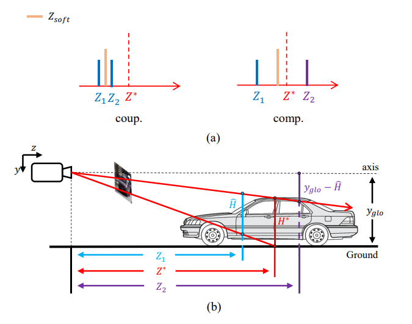

# MonoCD: Monocular 3D Object Detection with Complementary Depths
This repository includes an official implementation of the paper 'MonoCD: Monocular 3D Object Detection with Complementary Depths' based on the excellent work [MonoFlex](https://github.com/zhangyp15/MonoFlex). In this work, we first point out the coupling phenomenon that the existing multi-depth predictions have the tendency of predicted depths to consistently overestimate or underestimate the true depth values, which limits the accuracy of combined depth. We propose to increase the complementarity of depths through two novel designs to alleviate this problem.



## Installation

```bash
git clone https://github.com/dragonfly606/MonoCD.git

cd MonoCD

conda create -n monocd python=3.7

conda activate monocd

conda install pytorch==1.4.0 torchvision==0.5.0 cudatoolkit=10.1 -c pytorch

pip install -r requirements.txt

cd model/backbone/DCNv2

sh make.sh

cd ../../..

python setup.py develop
```

## Data Preparation

Please download [KITTI dataset](http://www.cvlibs.net/datasets/kitti/eval_object.php?obj_benchmark=3d) and organize the data as follows:

```
#ROOT		
  |training/
    |calib/
    |image_2/
    |label/
    |planes/
    |ImageSets/
  |testing/
    |calib/
    |image_2/
    |ImageSets/
```

The road planes for Horizon Heatmap training could be downloaded from [HERE](https://download.openmmlab.com/mmdetection3d/data/train_planes.zip). Then remember to set the `DATA_DIR = "/path/to/your/kitti/"` in the `config/paths_catalog.py` according to your data path.

## Get Started

### Train

Training with one GPU.

```bash
CUDA_VISIBLE_DEVICES=0 python tools/plain_train_net.py --batch_size 8 --config runs/monocd.yaml --output output/exp
```

### Test

The model will be evaluated periodically during training and you can also evaluate an already trained checkpoint with

```bash
CUDA_VISIBLE_DEVICES=0 python tools/plain_train_net.py --config runs/monocd.yaml --ckpt YOUR_CKPT  --eval
```

### Model and log

We provide the trained model on KITTI and corresponding logs.

| Models                       | AP40@Easy | AP40@Mod. | AP40@Hard |                          Logs/Ckpts                          |
| ---------------------------- | :-------: | :-------: | :-------: | :----------------------------------------------------------: |
| MonoFlex                     |   23.64   |   17.51   |   14.83   |                              -                               |
| MonoFlex + Ours (paper)      |   24.22   |   18.27   |   15.42   |                              -                               |
| MonoFlex + Ours (reproduced) |   25.99   |   19.12   |   16.03   | [log](https://drive.google.com/file/d/1oYF4HfeZPaWiJ0IOv62UjoDkCjLtK20_/view?usp=sharing)/[ckpt](https://drive.google.com/file/d/1DbMaicafWnP-MDJAQiwnUs7QI809LbSA/view?usp=sharing) |

## Citation

If you find our work useful in your research, please consider giving us a star and citing:

```latex
@inproceedings{yan2024monocd,
  title={MonoCD: Monocular 3D Object Detection with Complementary Depths},
  author={Yan, Longfei and Yan, Pei and Xiong, Shengzhou and Xiang, Xuanyu and Tan, Yihua},
  booktitle={CVPR},
  year={2024}
}
```

## Acknowledgement

This project benefits from awesome works of [MonoFlex](https://github.com/zhangyp15/MonoFlex) and [MonoGround](https://github.com/cfzd/MonoGround). Please also consider citing them.

## Contact

If you have any questions about this project, please feel free to contact longfeiyan@hust.edu.cn.
